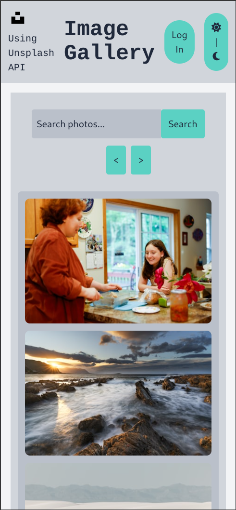

# Globant-Piscine-FullStack---ImageGallery

An online gallery using the Unsplash API to get the images. Works on both pc and mobile. Has a dark mode implemented. When logging in with an Unsplash account, it lets you add images to your favourites. You can also remove images from your favourites.


---


### Set up
This project uses docker and so it needs to be launched with:
```
docker-compose up --build
```
in the terminal of the project. After building, you need to go to your prefered browser and get into:
```
localhost:8080
```
For cleaning, you need to write in terminal:
```
docker-compose down -v
```


---

pc view | mobile view | search + dark mode
:-------:|:----------:|:------------------|
 |  | 